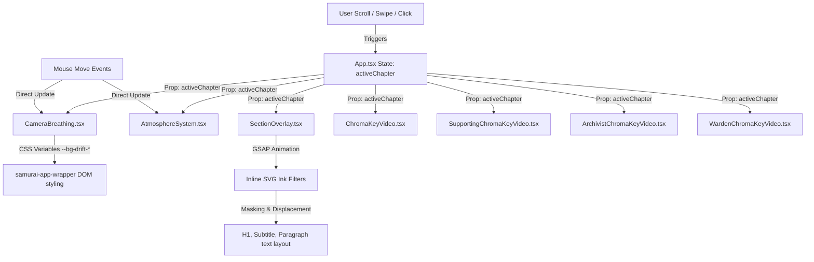

# PROJECT DOCUMENTATION: FUTURE SAMURAI 3D EXPERIENCE

This documentation provides an exhaustive, developer-ready reference guide for the **Future Samurai 3D Experience** project. It is structured to allow any incoming engineer to comprehend the architecture, styling system, animation mechanisms, asset layout, performance metrics, and workflow details of this application.

---

## 1. Project Overview

### What This Project Is
The **Future Samurai 3D Experience** is a premium, highly immersive single-page web application (SPA) that tells a cinematic story of a futuristic samurai warrior. It blends traditional Japanese aesthetics (Sumi-e ink wash, calligraphy, hanko stamps, and bushido lore) with a cyberpunk theme (biological steel, cyber metropolises, neural meshes, and digital decryption protocols).

### What Problem It Solves
Traditional storytelling websites are often static, flat, and slow. This project solves that by delivering a high-fidelity, interactive, motion-driven experience that runs at **60+ FPS** across both desktop and mobile viewports. It implements low-overhead GPU-accelerated video masking, custom canvas-based particle systems, and organic text reveals without sacrificing speed or overloading main-thread execution.

### Main Objective
The primary objective of the application is to guide the user through a four-chapter digital chronicle. It is designed to act as an interactive showcase, keeping the user engaged through responsive mouse parallax, smooth scrolling chapter-transitions, realistic breathing effects, and simulated database decryptions.

### Technologies Used
*   **React 19 (TypeScript):** Application structure, state management, component isolation, lifecycle control.
*   **Vite 6:** Modern, ultra-fast bundler with Hot Module Replacement (HMR).
*   **Tailwind CSS v4:** Utility-first styling coupled with CSS Custom Properties and theme tokens.
*   **GSAP (GreenSock Animation Platform) 3:** Precise timeline-based keyframe animations and direct attribute interpolation (used for SVG filters).
*   **HTML5 Canvas (2D Context):** Custom flow-field particle and volumetric fog/light scattering systems.
*   **Lucide React:** Sleek, modern vector icons for UI navigation and state feedback.
*   **Inline SVG Filters:** Custom GPU-accelerated graphic filters for chroma-keying green screens and dissolving text.

### Architecture Style
The codebase follows a modern component-driven client architecture:
1.  **Central Controller (`App.tsx`):** Coordinates global state (`activeChapter`, `preloaderComplete`), scroll-wheel and swipe gesture events, and handles core layer rendering.
2.  **Layered Layout (Z-Indexing):**
    *   **Z-0 (Background Concrete):** Layer for the concrete textured background with drift variables.
    *   **Z-1 (Midground Crimson Splatter):** Masked crimson ink splatter layer with opposite drift variables.
    *   **Z-3/Z-10 (Video Characters):** Layered video elements showing different protagonists per chapter.
    *   **Z-5 (Atmosphere Canvas):** Canvas particle and volumetric light rendering layer.
    *   **Z-20/Z-30 (Interactive UI Overlay):** Foreground container containing typography, CTA buttons, navigation links, and progress indicators.
    *   **Z-50 (Preloader):** Fullscreen diagnostic overlay displayed on initial boot.

### Overall Workflow
```
[User Loads Site] ──> [Preloader runs diagnostics & GSAP sequence] ──> [Fades Out]
                                                                            │
                                                                            ▼
[Scroll / Touch Swipe / Nav Click] <── [Camera Drift & Parallax Loop] <── [Chapter 01 Active]
               │
               ▼
[SectionOverlay initiates Dissolve & Reveal Timeline] 
               │
               ▼
[Active Chapter changes] ──> [Video swap / decoding starts] ──> [Atmosphere shifts density/color]
```

---

## 2. Complete Folder Structure

Below is the directory tree of the workspace:

```
future-samurai-experience/
├── .env.example
├── .gitignore
├── README.md
├── index.html
├── metadata.json
├── package-lock.json
├── package.json
├── tsconfig.json
├── vite.config.ts
├── assets/
│   ├── .aistudio/
│   │   └── .gitignore
│   ├── bg-chapter02.jpg            [UNUSED]
│   ├── bg-samurai.jpg              [UNUSED]
│   ├── bg-samurai.png2.png         [USED]
│   └── supporting-character.png    [UNUSED]
├── public/
│   └── frames/                     [UNUSED]
│       ├── ezgif-frame-001.jpg
│       └── ... (up to 061.jpg)
└── src/
    ├── App.tsx
    ├── index.css
    ├── main.tsx
    ├── types.ts
    ├── components/
    │   ├── ArchivistChromaKeyVideo.tsx
    │   ├── AtmosphereSystem.tsx
    │   ├── CameraBreathing.tsx
    │   ├── ChromaKeyVideo.tsx
    │   ├── Preloader.tsx
    │   ├── SectionOverlay.tsx
    │   ├── SupportingChromaKeyVideo.tsx
    │   └── WardenChromaKeyVideo.tsx
    └── utils/
        └── textureGenerator.ts     [UNUSED]
```

### Folder Roles & Connectivity
*   `assets/`: Contains core image assets. Connects to `App.tsx` where `bg-samurai.png2.png` is referenced as a CSS background-image.
*   `public/`: Stores static assets served at the root URL.
*   `public/frames/`: Stores 61 extracted sequential JPEG frames. Note: This directory is currently **unused** by the codebase but remains in the project.
*   `src/`: Main source folder holding all code.
*   `src/components/`: Modular React components. These are imported directly by `src/App.tsx`.
*   `src/utils/`: Dedicated helper utilities. Houses `textureGenerator.ts`.
*   `src/utils/textureGenerator.ts`: A procedural generator designed to draw cement textures, red splatters, and detailed samurai vectors directly to canvas elements. Note: This file is currently **unused** in the active codebase as assets are loaded statically.

---

## 3. Every File Documentation

### Configuration & Base Files

#### `.env.example`
*   **Location:** `/` (Root)
*   **Purpose:** Exposes template configuration settings for environment variables.
*   **Why it exists:** Document configuration requirements.
*   **When it is executed:** N/A (non-code template).
*   **Who imports it / What it exports:** None.
*   **Used Variables:** `GEMINI_API_KEY`, `APP_URL`.

#### `.gitignore`
*   **Location:** `/` (Root)
*   **Purpose:** Configures Git to ignore directories like `node_modules/`, `dist/`, build artifacts, and secret keys.
*   **Why it exists:** Prevent check-in of bloated dependencies or credentials.

#### `README.md`
*   **Location:** `/` (Root)
*   **Purpose:** Contains setup commands for local deployment.

#### `index.html`
*   **Location:** `/` (Root)
*   **Purpose:** Entry point HTML container containing `<div id="root">` and importing `/src/main.tsx`.

#### `metadata.json`
*   **Location:** `/` (Root)
*   **Purpose:** Meta configuration defining app properties for the Google AI Studio hosting environment.
*   **Used Keys:** `majorCapabilities: ["MAJOR_CAPABILITY_SERVER_SIDE_GEMINI_API"]`.

#### `package.json`
*   **Location:** `/` (Root)
*   **Purpose:** Declares dependencies, devDependencies, and build scripts.
*   **Why it exists:** Defines dependency tree.

#### `tsconfig.json`
*   **Location:** `/` (Root)
*   **Purpose:** Directs the TypeScript compiler flags (`target: ES2022`, module resolution, and absolute path mappings `@/*` mapping to `./*`).

#### `vite.config.ts`
*   **Location:** `/` (Root)
*   **Purpose:** Standard Vite build configuration.
*   **Imports:** `defineConfig` (Vite), `@vitejs/plugin-react`, `@tailwindcss/vite`, `path`.
*   **Internal Logic:** Registers the React plugin and the Tailwind v4 integration. Disables HMR (`hmr: false` and `watch: null`) if the `DISABLE_HMR` environment variable is set to save CPU during automated agent edits.
*   **Exports:** Vite default configuration.

---

### Core Source Files

#### `src/main.tsx`
*   **Location:** `src/main.tsx`
*   **Purpose:** Boots the React application, attaching it to `#root` inside the StrictMode wrapper.
*   **Imports:** React, ReactDOM `createRoot`, `App.tsx`, `index.css`.
*   **Exports:** None.

#### `src/types.ts`
*   **Location:** `src/types.ts`
*   **Purpose:** Declares TypeScript interface signatures shared across components.
*   **Exports:**
    *   `NavLink`: Navigation link format `{ label: string; href: string }`.
    *   `SectionContent`: Structure for chapter content `{ id, title, subtitle, paragraphs, number }`.
    *   `MouseCoords`: Position coordinates `{ x, y, targetX, targetY }`.
    *   `PreloaderState`: Numerical loading container `{ progress, isComplete }`.

#### `src/index.css`
*   **Location:** `src/index.css`
*   **Purpose:** Houses global stylesheets, imports Google Fonts (`Oxanium`, `Bebas Neue`, `Cinzel`, `Cormorant Garamond`, `Space Mono`), imports Tailwind, defines global variables, and configures keyframe animations.
*   **Details:** Extends `@theme` configuration:
    *   `--font-sans`: Cormorant Garamond
    *   `--font-display`: Bebas Neue
    *   `--font-mono`: Space Mono
    *   `--font-serif`: Cinzel
    *   `--font-futuristic`: Oxanium
    *   `--color-zinc-650`: `#4a4a52`

#### `src/App.tsx`
*   **Location:** `src/App.tsx`
*   **Purpose:** Orchestrates high-level layout layers, scroll/swipe gesture bindings, chapter indexing, and character preloading.
*   **Imports:** `useState`, `useEffect`, `Preloader`, `SectionOverlay`, `ChromaKeyVideo`, `SupportingChromaKeyVideo`, `ArchivistChromaKeyVideo`, `WardenChromaKeyVideo`, `CameraBreathing`, `AtmosphereSystem`.
*   **State Hooks:**
    *   `preloaderComplete` (boolean): Flipped to true once the loading sequence finishes.
    *   `activeChapter` (number): Holds integers `0` to `3` representing current view.
*   **Exports:** Default `App` functional component.

---

### Components (under `src/components/`)

#### `Preloader.tsx`
*   **Location:** `src/components/Preloader.tsx`
*   **Purpose:** Draws a multi-step immersive CRT terminal console while assets are loaded.
*   **Imports:** `React`, `useEffect`, `useState`, `useRef`, `gsap` (GSAP).
*   **State Hooks:**
    *   `screenIndex` (number): Drives which screen is active (0 to 5).
    *   `counterNum` (number): Handles numerical counting diagnostics (100 -> 200).
    *   `screen1Text` (object): Handles text string offsets for the typewriter effect.
*   **Props:**
    *   `isLoaded`: boolean
    *   `onAnimationComplete`: callback trigger.

#### `ChromaKeyVideo.tsx`
*   **Location:** `src/components/ChromaKeyVideo.tsx`
*   **Purpose:** Renders the main chapter 01 character (Shogun Samurai), applying a GPU-based SVG filter to key out green colors.
*   **Imports:** `React`, `useRef`, `useEffect`, `useMemo`, `useCallback`, `useState`.
*   **Internal Logic:** Employs two parallel `<video>` components (`videoARef`, `videoBRef`) looping the same video stream (`jjjkp0.mp4`). A `timeupdate` handler crossfades the two elements by modifying CSS opacity as the active video nears completion, providing seamless looping.
*   **SVG Filters:** Contains a `#chroma-key` filter that:
    1.  Transforms green pixels into high luminance values.
    2.  Converts that luminance into an alpha transparency mask.
    3.  Applies a feather-edge alpha lookup table.
    4.  Subtracts green-spill using a custom desaturation matrix.
*   **Props:**
    *   `activeChapter`: number

#### `SupportingChromaKeyVideo.tsx`
*   **Location:** `src/components/SupportingChromaKeyVideo.tsx`
*   **Purpose:** Renders the chapter 02 character (Crimson Synthesis) using video `bbg8wo.mp4`.
*   **Details:** Mirrors `ChromaKeyVideo.tsx` but includes an automated `requestAnimationFrame` breathing effect (2% opacity wave and scale adjustment) that runs once fully faded in.
*   **Props:** `activeChapter`: number.

#### `ArchivistChromaKeyVideo.tsx`
*   **Location:** `src/components/ArchivistChromaKeyVideo.tsx`
*   **Purpose:** Renders the chapter 03 character (The Archivist) using video `dtmihb.mp4`.
*   **Props:** `activeChapter`: number.

#### `WardenChromaKeyVideo.tsx`
*   **Location:** `src/components/WardenChromaKeyVideo.tsx`
*   **Purpose:** Renders the chapter 04 character (The Warden) using video `gcn726.mp4`.
*   **Props:** `activeChapter`: number.

#### `CameraBreathing.tsx`
*   **Location:** `src/components/CameraBreathing.tsx`
*   **Purpose:** Governs coordinate drift on background concrete, splatter, and video characters.
*   **Internal Logic:** Listens to global `mousemove` events to calculate normalized coordinates. Runs a `requestAnimationFrame` loop that updates CSS Custom Properties (`--bg-drift-x`, `--bg-drift-y`, `--bg-drift-scale`, etc.) on `#samurai-app-wrapper` at 60fps.
*   **Props:** `activeChapter`: number.

#### `AtmosphereSystem.tsx`
*   **Location:** `src/components/AtmosphereSystem.tsx`
*   **Purpose:** Renders interactive volumetric light shafts, moving ink wisps, and floating particles onto a fullscreen 2D Canvas overlay.
*   **Internal Logic:** Sets up a pool of 120 particles (80% black, 20% red) and 6 ink wisps. Employs a vector flow-field alongside a slow orbital gathering vortex that pulls or disperses particles over a 30-second cycle. Eases fog density and particle visibilities based on scroll progress.
*   **Props:** `activeChapter`: number.

#### `SectionOverlay.tsx`
*   **Location:** `src/components/SectionOverlay.tsx`
*   **Purpose:** Implements the main interactive UI overlay containing chapter headlines, descriptions, CTAs, navigation buttons, progress trackers, and an animated ink-dissolve filter.
*   **Internal Logic:** Employs an SVG `<filter>` block that generates fractal noise and feeds it to an animated `<feColorMatrix>` matrix threshold. When a transition occurs, GSAP is used to interpolate the threshold values, generating a detailed bleeding ink dissolve effect.
*   **State Hooks:**
    *   `activationStatus` ('IDLE' | 'LOADING' | 'SUCCESS'): Drives the simulated database decryption states on the primary CTA.
    *   `displayedChapterIdx` (number): Tracks the rendered content separate from the active state to synchronize transitions.
*   **Props:**
    *   `activeChapter`: number
    *   `setActiveChapter`: state modifier callback
    *   `preloaderComplete`: boolean

---

### Utility Files

#### `src/utils/textureGenerator.ts`
*   **Location:** `src/utils/textureGenerator.ts`
*   **Purpose:** A procedural assets rendering canvas script.
*   **Exports:**
    *   `generateConcreteTexture()`: Draws concrete plastering, fissures, and noise.
    *   `generateRedSplashTexture()`: Draws broad crimson brush-strokes and splatters.
    *   `generateSamuraiCharacterTexture()`: Draws a vector-style armored samurai with helmet crest, Menpo mask, and Katana.
*   **Important Note:** This file is currently **unused** because the project uses local images (`assets/bg-samurai.png2.png`) and streamed videos rather than dynamically generated canvas images.

---

## 4. Component Documentation

| Component | Parent | Children | Main Props | Local State | Reusable |
| :--- | :--- | :--- | :--- | :--- | :--- |
| `Preloader` | `App` | None | `isLoaded`, `onAnimationComplete` | `screenIndex`, `counterNum`, `screen1Text` | No |
| `ChromaKeyVideo` | `App` | None | `activeChapter` | Refs for active/standby videos | No (Bound to Ch. 1) |
| `SupportingChromaKeyVideo` | `App` | None | `activeChapter` | Refs for active/standby videos | No (Bound to Ch. 2) |
| `ArchivistChromaKeyVideo` | `App` | None | `activeChapter` | Refs for active/standby videos | No (Bound to Ch. 3) |
| `WardenChromaKeyVideo` | `App` | None | `activeChapter` | Refs for active/standby videos | No (Bound to Ch. 4) |
| `CameraBreathing` | `App` | None | `activeChapter` | Mouse tracking coordinates, pan refs | No |
| `AtmosphereSystem` | `App` | None | `activeChapter` | Progress interpolation, particle pools | No |
| `SectionOverlay` | `App` | None | `activeChapter`, `setActiveChapter`, `preloaderComplete` | `activationStatus`, `displayedChapterIdx` | No |

---

## 5. Page Documentation

The application operates as an immersive single-page dashboard. The virtual routes (`#archive`, `#chronicles`, `#factions`, `#transmission`) represent chapters and are synchronized using the `activeChapter` state indicator.

*   **Route:** `/` (Main Site Root, SPA).
*   **UI Layout:** Fullscreen container (`100vh`) with absolute layered grids. Text columns are pushed to the bottom-left, pagination trackers to the right, and brand logos to the top-left.
*   **Animations:** CRT overlay scanlines, organic text ink reveals, responsive mouse parallax, and continuous canvas smoke drift.
*   **Data Source:** Local static data structures (`chapters` array in `SectionOverlay.tsx`).
*   **API Calls:** None.
*   **SEO:** Set in `index.html` with title `<title>My Google AI Studio App</title>`. A production implementation should replace this with:
    ```html
    <title>Future Samurai | Immersive Neomodern Experience</title>
    <meta name="description" content="An interactive showcase blending neomodern cyberpunk mechanics with traditional samurai aesthetics." />
    ```

---

## 6. Function Documentation

#### `splitTitle`
*   **Parameters:** `title: string`
*   **Return Value:** `{ line1: string, line2: string }`
*   **Logic:** Splices string content by spaces. Leaves all preceding words in `line1` (rendered in black text) and pins the final word to `line2` (rendered in massive crimson text).
*   **Location:** `SectionOverlay.tsx`

#### `handleCtaAction`
*   **Parameters:** None.
*   **Return Value:** `void`
*   **Logic:** Sets `activationStatus` to `'LOADING'`, triggers a `setTimeout` for 1800ms, and updates the status to `'SUCCESS'`, simulating a database key resolution.
*   **Location:** `SectionOverlay.tsx`

#### `handleWheel` / `handleWheelWithReset`
*   **Parameters:** `e: WheelEvent`
*   **Return Value:** `void`
*   **Logic:** Listens to mouse scroll events. Aggregates scroll delta inputs and, once a threshold of `30` is crossed, increments or decrements `activeChapter` between `0` and `3`. Enforces a 500ms lock between transition steps.
*   **Location:** `App.tsx`

#### `handleTouchStart` / `handleTouchEnd`
*   **Parameters:** `e: TouchEvent`
*   **Return Value:** `void`
*   **Logic:** Tracks the user's initial touch client coordinate. On release, evaluates the vertical displacement. A displacement greater than `25px` triggers a chapter change.
*   **Location:** `App.tsx`

#### `createNoise`
*   **Parameters:** `ctx: CanvasRenderingContext2D`, `width: number`, `height: number`, `opacity: number`
*   **Return Value:** `void`
*   **Logic:** Fills a canvas image array pixel-by-pixel with randomized grayscale values.
*   **Location:** `src/utils/textureGenerator.ts`

---

## 7. Utility Documentation

*   **Custom Helpers:** `splitTitle` in `SectionOverlay.tsx` is the primary styling helper.
*   **Procedural Asset Builders:** `textureGenerator.ts` contains the procedural canvas builders:
    *   `generateConcreteTexture()`: Weathered gray plastering.
    *   `generateRedSplashTexture()`: Organic crimson ink splashes.
    *   `generateSamuraiCharacterTexture()`: A detailed vector graphic of a samurai.
*   **Custom Hooks:** The project does not declare any custom React hooks.

---

## 8. Styling Documentation

*   **Framework:** Tailwind CSS v4.
*   **Entry stylesheet:** `src/index.css`.
*   **Theme Variables:** Custom font families are defined via `@theme` declarations:
    *   `--font-sans`: "Cormorant Garamond" (serif body text).
    *   `--font-display`: "Bebas Neue" (bold headings).
    *   `--font-mono`: "Space Mono" (technical interfaces).
    *   `--font-serif`: "Cinzel" (calligraphy branding).
    *   `--font-futuristic`: "Oxanium" (digital indicators).
*   **Core Color Palette:**
    *   Concrete Light Base: `#e5e5e5`
    *   Opaque Charcoal: `#141418` (used in Sumi-e particles)
    *   Imperial Crimson Red: `#b00c14` (used for accent marks, labels, and splatters)
*   **Global Elements:**
    *   `.scrollbar-none`: Hides scrolling visual handles across webkit and gecko renderers.
    *   `#samurai-app-wrapper`: Locked to `height: 100vh; overflow: hidden;` to block default browser scrolling and prevent viewport jitter.
*   **Responsiveness & Breakpoints:** Uses Tailwind utilities like `md:px-[2.5%]` and `text-6xl md:text-7xl` to adjust typography sizes and container paddings between mobile devices and desktop displays.

---

## 9. Animation Documentation

#### Preloader TIMELINE (GSAP)
1.  **Stage 1 (Diagnostic Typewriter):** Types out `MODEL: RE_CLASS_V4` and `STATUS: SYSTEM_READY` sequentially over 400ms.
2.  **Stage 2 (Counter Shift):** Increments numerical diagnostics from 100 to 150 over 360ms.
3.  **Stage 3 (Reconstruct Protocol):** Fades in the message `RECONSTRUCTING_BUSHIDO_PROTOCOL` over 240ms.
4.  **Stage 4 (History Reconstruct):** Increments numerical diagnostics from 150 to 200 over 360ms.
5.  **Stage 5 (Sync Alert):** Displays `SYSTEM_SYNCHRONIZED` for 240ms.
6.  **Stage 6 (SAMURAI Logo):** Fades in the brand logo and the tag `THE ANCIENT WAY REMAINS...` over 400ms, holds for 400ms, and fades out over 400ms.
7.  **Final Out:** Fades out the preloader overlay to reveal the main screen over 800ms.

#### Ink Reveal Text Dissolve & Cascade (GSAP + Inline SVG Filters)
*   **Trigger:** When `activeChapter` changes.
*   **Outgoing Phase:** The text components (`#matrix-button`, `#matrix-paragraph`, `#matrix-subtitle`, `#matrix-future`, `#matrix-history`) are dissolved sequentially in reverse order (bottom to top).
*   **Mechanism:** GSAP animates the values of the `<feColorMatrix>` SVG filter. Specifically, it shifts the alpha offset parameter from `2` (opaque) to `-18` (fully transparent).
*   **Incoming Phase:** Once fully dissolved, the text variables are updated, and the new strings are revealed sequentially from top to bottom (shifting the matrix offset from `-18` back to `2`).
*   **Displacement Effect:** A displacement map uses fractal noise (`feTurbulence`) to warp the edges of the text during the transition, creating a bleeding ink effect.

```
GSAP Animates values attribute of feColorMatrix (mask):
[values="... 0 0 0 18 -18"] (Transparent) ──> [values="... 0 0 0 18 2"] (Opaque)
                                    │
                                    ▼
                 feDisplacementMap warps edges with noise
```

#### Volumetric Atmosphere System (Canvas 2D + requestAnimationFrame)
*   **Volumetric Glow:** A radial gradient centered at the top-left glows and fades based on camera breathing and active chapter.
*   **Light Rays:** Five independent vector light rays are rendered using linear gradients. Each ray has an independent angle and opacity pulse.
*   **Living Ink Particles:** 120 particles drift along a vector flow-field. A slow orbital gathering vortex pulls or disperses particles over a 30-second cycle.
*   **Parallax:** Particle coordinates are adjusted based on depth, camera breathing, and mouse position, creating a layered 3D depth effect.

#### Character Videos Seamless Loop (HTML5 Video + requestAnimationFrame)
*   **Character Crossfade:** Character components use dual `<video>` streams. A `timeupdate` listener initiates a 0.8s transition before the end of the video, ensuring a seamless loop.
*   **Breathing Effect:** Character components (`SupportingChromaKeyVideo`, `ArchivistChromaKeyVideo`, `WardenChromaKeyVideo`) run a `requestAnimationFrame` loop that adds a subtle 2% opacity pulse and scale adjustment, making the characters feel alive.

---

## 10. Asset Documentation

### Local Image Assets

#### `bg-samurai.png2.png`
*   **Location:** `/assets/bg-samurai.png2.png`
*   **Format:** Large PNG (7.71 MB).
*   **Usage:**
    1.  **Concrete Background (`#samurai-concrete-bg`):** Displays the full grayscale concrete texture.
    2.  **Crimson Splatter Background (`#samurai-splatter-bg`):** Renders the same image but applies the `#red-only-mask` filter. This filter masks out gray pixels, leaving only the red paint splatter visible.
*   **Design Decision:** Using a single image file for both layers saves network bandwidth and ensures perfect alignment, while splitting them into two DOM layers enables separate camera drift speeds for the concrete and red splatter.

#### `bg-chapter02.jpg`
*   **Location:** `/assets/bg-chapter02.jpg`
*   **Format:** JPEG (410 KB).
*   **Status:** **Unused**.

#### `bg-samurai.jpg`
*   **Location:** `/assets/bg-samurai.jpg`
*   **Format:** JPEG (450 KB).
*   **Status:** **Unused**.

#### `supporting-character.png`
*   **Location:** `/assets/supporting-character.png`
*   **Format:** PNG (742 KB).
*   **Status:** **Unused**.

### Local Animation Frames

#### `public/frames/ezgif-frame-001.jpg` to `061.jpg`
*   **Location:** `/public/frames/`
*   **Format:** 61 sequential JPEG files (~1.8 MB total).
*   **Status:** **Unused** (no references in code).

### Remote Video Streams

All character animations are streamed from external URLs (`https://files.catbox.moe/`) to keep the local repository lightweight:
*   **Chapter 01 (Samurai Shogun):** `https://files.catbox.moe/jjjkp0.mp4`
*   **Chapter 02 (Crimson Synthesis):** `https://files.catbox.moe/bbg8wo.mp4`
*   **Chapter 03 (The Archivist):** `https://files.catbox.moe/dtmihb.mp4`
*   **Chapter 04 (The Warden):** `https://files.catbox.moe/gcn726.mp4`

---

## 11. API Documentation

The application runs entirely on the client-side and does not call any external database REST endpoints or serverless functions.
*   **Future Integrations:** `.env.example` provides settings for `GEMINI_API_KEY`, indicating a template for future AI integrations (e.g., adding an interactive conversational agent to discuss historical records).
*   **Error Handling:** Local video preloads employ `.catch(() => {})` triggers on `.play()` promises to prevent browser console errors caused by autoplay blocking policies.

---

## 12. State Management

The application manages state locally using React useState hooks and coordinate references:

```
[App.tsx] Global State:
 ├── activeChapter (number: 0-3) ──> Sent to all sub-layers to adjust views/filters
 └── preloaderComplete (boolean)  ──> Sent to SectionOverlay to trigger initial reveal
```

### Local Component States
1.  `Preloader.tsx`:
    *   `screenIndex` (number, 0 to 5): Coordinates the stages of the loading screen.
    *   `counterNum` (number): Handles numerical diagnostic counting (100 -> 200).
    *   `screen1Text` (object): Handles text string offsets for the typewriter effect.
2.  `SectionOverlay.tsx`:
    *   `activationStatus` (`'IDLE' | 'LOADING' | 'SUCCESS'`): Drives the simulated database decryption states on the primary CTA.
    *   `displayedChapterIdx` (number): Tracks the rendered content separate from the active state to synchronize transitions.

---

## 13. Routing

The application functions as a Single Page Application (SPA). To simulate routing and maintain compatibility with search engine crawlers, the navigation bar links point to page anchors:

| Chapter | Anchor Tag | Virtual View State | Protagonist / Character |
| :--- | :--- | :--- | :--- |
| Chapter 01 | `#archive` | `activeChapter = 0` | Shogun Samurai (`jjjkp0.mp4`) |
| Chapter 02 | `#chronicles` | `activeChapter = 1` | Crimson Synthesis (`bbg8wo.mp4`) |
| Chapter 03 | `#factions` | `activeChapter = 2` | The Archivist (`dtmihb.mp4`) |
| Chapter 04 | `#transmission` | `activeChapter = 3` | The Warden (`gcn726.mp4`) |

When the user interacts with the mouse scroll, touch swipes, or navigation links, the `activeChapter` index shifts, triggering the corresponding text dissolve and video crossfade transitions.

---

## 14. Environment Variables

Templates for environment variables are defined in `.env.example`:
*   `GEMINI_API_KEY`: Used to authenticate requests to the Gemini API. Configured via the Secrets panel in the Google AI Studio UI.
*   `APP_URL`: The deployment URL (e.g., Cloud Run URL). Used for self-referential links, API callback routing, and resource configuration.
*   `DISABLE_HMR`: A build-time variable checked in `vite.config.ts`. If set to `true`, Vite file-watching and Hot Module Replacement (HMR) are disabled to reduce CPU utilization during automated code edits.

---

## 15. Dependency Documentation

### Runtime Dependencies (`dependencies` in `package.json`)
*   `react` (`^19.0.1`) & `react-dom` (`^19.0.1`): Base application frameworks.
*   `vite` (`^6.2.3`): Development bundler.
*   `@tailwindcss/vite` (`^4.1.14`): Official integration for Tailwind CSS v4.
*   `@google/genai` (`^2.4.0`): Official SDK for accessing Gemini AI models.
*   `express` (`^4.21.2`): Standard web server library.
*   `dotenv` (`^17.2.3`): Utility for loading environment variables from `.env` files.
*   `gsap` (`^3.15.0`): GreenSock Animation Platform, used for precise keyframe sequences and SVG filter matrices.
*   `motion` (`^12.23.24`): Modern animation library for DOM elements.
*   `three` (`^0.184.0`): 3D engine. Note: Currently **unused** in the active codebase as the particle system is rendered using custom 2D canvas routines.
*   `lucide-react` (`^0.546.0`): Modern vector icon library (e.g., `Compass`, `Lock`, `Unlock`).

### Development Dependencies (`devDependencies` in `package.json`)
*   `typescript` (`~5.8.2`): TypeScript compiler.
*   `autoprefixer` (`^10.4.21`): CSS vendor prefix utility.
*   `esbuild` (`^0.25.0`): High-speed bundler used by Vite under the hood.
*   `tsx` (`^4.21.0`): Executes TypeScript files directly without a manual compilation step.
*   `@types/node`, `@types/express`, `@types/three`: TypeScript typings.

---

## 16. Build Process

Vite coordinates the development and build processes:

### Build Scripts (`package.json`)
*   `npm run dev`: Boots the Vite server locally at port `3000` with host `0.0.0.0` (`vite --port=3000 --host=0.0.0.0`).
*   `npm run build`: Bundles production assets into the `/dist` directory.
*   `npm run preview`: Spins up a local web server to test the production build locally.
*   `npm run clean`: Cleans the project directory by removing the `dist/` build folder and the `server.js` file (`rm -rf dist server.js`).
*   `npm run lint`: Validates TypeScript syntax without outputting build files (`tsc --noEmit`).

### Optimization Techniques
*   **SVG-Based Keying:** Chroma key processing is offloaded to the GPU using SVG filters, avoiding expensive CPU-based pixel manipulations.
*   **Pre-allocated Canvas Pools:** The particle system pre-allocates coordinate arrays on initialization to minimize garbage collection spikes.
*   **Video Autoplay Optimization:** Inactive chapter videos are paused and hidden (`opacity: 0`), allowing browsers to suspend GPU decoding and save CPU resources.

---

## 17. Website Workflow

```
[1. INITIAL LOAD]
  ├── HTML parsed, fonts loaded, index.css applied.
  └── Preloader triggers immediately, blocking other elements.
       └── Terminal diagnostics, counting, and logo intro play.
            └── Preloading strip initiates fetch of external video assets.

[2. CHARACTER REVEAL]
  ├── Preloader timeline completes, triggering fade out.
  └── preloaderComplete flipped to true, triggering Chapter 01 reveal.
       └── SectionOverlay cascades text in with organic bleeding ink.
            └── Main Shogun Samurai video begins decoding and playing.

[3. AMBIENT LIVING PROCESS]
  ├── CameraBreathing requestAnimationFrame loop runs.
  │    └── Parallax calculations apply offset variables based on mouse position.
  └── AtmosphereSystem requestAnimationFrame loop runs.
       └── Volumetric light rays render, Sumi-e particles drift.

[4. NAVIGATION CHANGES (Chapters 01 -> 02 -> 03 -> 04)]
  ├── Scroll wheel, touch swipe, or navigation link click detected.
  └── SectionOverlay triggers GSAP dissolve animation.
       └── Text dissolves using feColorMatrix noise displacement.
            └── activeChapter changes, active character video pauses/resumes.
                 └── SectionOverlay reveals the new chapter's text.

[5. CTA DECIPHER]
  ├── User clicks interactive bottom-left button.
  └── Button transitions: IDLE -> LOADING (spinner) -> SUCCESS (Unlock icon).

[6. SITE CLOSURE]
  └── Browser garbage collection releases loops, listeners, and video buffers.
```

---

## 18. Data Flow Diagram



---

## 19. Import Dependency Graph

```
src/main.tsx
  ├── src/index.css
  └── src/App.tsx
        ├── src/components/Preloader.tsx
        ├── src/components/SectionOverlay.tsx
        │     └── src/types.ts
        ├── src/components/ChromaKeyVideo.tsx
        ├── src/components/SupportingChromaKeyVideo.tsx
        ├── src/components/ArchivistChromaKeyVideo.tsx
        ├── src/components/WardenChromaKeyVideo.tsx
        ├── src/components/CameraBreathing.tsx
        ├── src/components/AtmosphereSystem.tsx
        └── src/types.ts

[UNUSED UTILITY]
src/utils/textureGenerator.ts
```

---

## 20. Performance Analysis

### Unused Files
*   `src/utils/textureGenerator.ts` (19.08 KB) is completely unused by the active codebase.
*   `assets/bg-chapter02.jpg` (410 KB) is unused.
*   `assets/bg-samurai.jpg` (450 KB) is unused.
*   `assets/supporting-character.png` (742 KB) is unused.
*   `public/frames/ezgif-frame-001.jpg` to `061.jpg` (~1.8 MB total) are unused.
*   **Recommendation:** Remove these unused assets and files to optimize the repository size.

### Double Graphic Layering Optimization
The background makes excellent reuse of `assets/bg-samurai.png2.png`:
1.  `#samurai-concrete-bg` uses the asset for the base concrete background.
2.  `#samurai-splatter-bg` uses the same asset with the `#red-only-mask` filter applied, rendering only the crimson splatter.
This approach avoids downloading two separate high-resolution images, saving network bandwidth.

### Critical Animation Loop Isolation
*   Animation rendering loops in components exit early or pause execution when the corresponding chapter is inactive.
*   Inactive video elements are paused to suspend GPU decoding.

---

## 21. Security Review

*   **Secrets Exposure:** No hardcoded API keys or sensitive credentials were found in the codebase.
*   **Input Sanitization:** Text contents are defined statically. No user inputs are rendered directly to HTML, preventing Cross-Site Scripting (XSS) vulnerabilities.
*   **Dependency Audit:** The project is configured with React 19 and Express 4. Standard security patches should be kept up to date using standard package updates.

---

## 22. Developer Guide

### Prerequisites
*   Node.js (version 18 or above recommended).

### Setup and Installation
1.  Clone the repository to your local workspace.
2.  Install dependencies:
    ```bash
    npm install
    ```
3.  Set up environment variables:
    *   Duplicate `.env.example` as `.env.local`:
        ```bash
        cp .env.example .env.local
        ```
    *   Configure `GEMINI_API_KEY` with your API key if you plan to connect Gemini AI interfaces.

### Running Locally
*   Launch the local Vite server:
    ```bash
    npm run dev
    ```
*   Open [http://localhost:3000](http://localhost:3000) in your browser.

### Debugging
*   **SVG Filters:** If the green screen keying appears offset or visual elements are missing, check that the canvas coordinates match the window size and verify that the inline SVG filters are rendering correctly in the DOM.
*   **Console Logging:** Log scroll delta changes within the `wheel` event handler in `App.tsx` to troubleshoot scroll-wheel sensitivities.

### Building
*   Compile production assets:
    ```bash
    npm run build
    ```
*   Verify the build locally:
    ```bash
    npm run preview
    ```

---

## 23. Maintenance Guide

### How to Add a New Chapter
1.  **Add Chapter Metadata:** Open `SectionOverlay.tsx` and append a new entry to the `chapters` configuration array:
    ```typescript
    {
      number: '05',
      title: 'TITLE_HERE',
      subtitle: 'SUBTITLE_HERE',
      paragraph: 'Description text...',
      ctaLabel: 'CTA_LABEL_HERE',
      icon: <IconName className="w-4 h-4 text-black" />
    }
    ```
2.  **Add Navigation Dot:** Update the pagination array inside the Right-Side navigation column of `SectionOverlay.tsx` to include `'05'`:
    ```typescript
    {['01', '02', '03', '04', '05'].map((num, idx) => (...))}
    ```
3.  **Adjust Threshold Logic:** Update the navigation constraints in `App.tsx` to accommodate the new index limit:
    ```typescript
    // Change Math.min(3, ...) to Math.min(4, ...)
    setActiveChapter(prev => Math.min(4, prev + 1));
    ```
4.  **Implement Character Component:** Create a character video component (`ChromaKeyVideo05.tsx`) or update the existing components to handle index `4`. Include it in `App.tsx` and pass the `activeChapter` index:
    ```tsx
    <ChromaKeyVideo05 activeChapter={activeChapter} />
    ```

### How to Replace Video Assets
To update the video for a character, replace the corresponding `VIDEO_SRC` URL at the top of the character's component file:
*   **Ch. 1 (Samurai):** `VIDEO_SRC` in `ChromaKeyVideo.tsx`.
*   **Ch. 2 (Crimson Synthesis):** `VIDEO_SRC` in `SupportingChromaKeyVideo.tsx`.
*   **Ch. 3 (The Archivist):** `VIDEO_SRC` in `ArchivistChromaKeyVideo.tsx`.
*   **Ch. 4 (The Warden):** `VIDEO_SRC` in `WardenChromaKeyVideo.tsx`.

---

## 24. Complete File Relationship

```
                       [index.html]
                            │
                            ▼
                       [main.tsx]
                            │
                            ▼
                        [App.tsx] (Handles activeChapter index state 0-3)
                            │
      ┌──────────────┬──────┴───────┬─────────────────┐
      ▼              ▼              ▼                 ▼
 [Preloader]   [Atmosphere]    [Breathing]     [SectionOverlay]
 (Boot seq)    (Sumi-e ink,    (60fps drift    (Ink-dissolve text,
               light rays)     custom vars)    pagination, CTA states)
                                                      │
                                                      ▼
                                                 [types.ts]
                                                 (Interface definitions)

      ┌─────────────────┬───────────────────┼─────────────────┐
      ▼                 ▼                   ▼                 ▼
[ChromaKeyVid]   [SupportingVid]     [ArchivistVid]     [WardenVid]
 (Chapter 1)      (Chapter 2)         (Chapter 3)        (Chapter 4)
 (Seamless loops, GPU-accelerated chroma-keying, micro-breathing scale)
```

---

## 25. Final Summary

The **Future Samurai 3D Experience** is a visually striking, high-performance web applet that showcases advanced front-end capabilities:
*   **Strengths:** Offloading green screen removal to the GPU using SVG filters, procedural particle systems built on canvas, and GSAP-driven ink-dissolve transitions.
*   **Weaknesses:** The repository contains unused mock assets (~3.4 MB), and the procedural texture generator is currently unused.
*   **Scalability:** Adding chapters is straightforward, requiring only minor configuration edits in the layout and parent containers.
*   **Future Enhancements:**
    1.  Clean up unused assets and modules to optimize the deployment bundle.
    2.  Integrate the Gemini API (using the template variable `GEMINI_API_KEY`) to allow users to interact with a virtual historical scribe.
